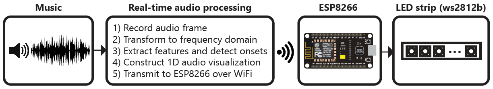
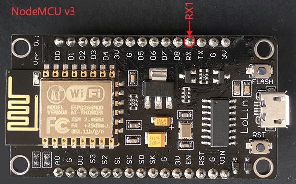
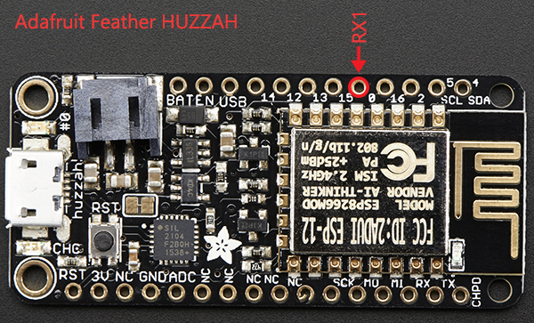

# audio-reactive-led-strip
Real-time LED strip music visualization using the ESP8266 and Python




# Demo (click gif for video)

[](https://www.youtube.com/watch?v=HNtM7jH5GXgD)

# Overview
The repository includes everything needed to build an LED strip music visualizer (excluding hardware):

- Python real-time visualization code, which includes code for:
  - Recording audio with a microphone ([microphone.py](python/microphone.py))
  - Digital signal processing ([dsp.py](python/dsp.py))
  - Constructing 1D visualizations ([visualization.py](python/visualization.py))
  - Sending pixel information to the ESP8266 over WiFi ([led.py](python/led.py))
- Arduino firmware for the ESP8266 ([ws2812_controller.ino](arduino/ws2812_controller/ws2812_controller.ino))

# What do I need to make one?
The following hardware is needed to build an LED strip music visualizer:
- Computer with Python 2.7 or 3.5 ([Anaconda](https://www.continuum.io/downloads) is recommended on Windows)
- Any ESP8266 module with RX1 pin exposed. ESP8266 modules can be purchased for as little as $5 to $10 USD. These modules are known to be compatible (but many others work too):
  - NodeMCU v3
  - Adafruit HUZZAH
  - Adafruit Feather HUZZAH
- Any ws2812b LED strip (such as Adafruit Neopixels). Many suppliers sell ws2812b LED strips for as little as $5-15 USD per meter.

# Installation
## Python Dependencies
Visualization code is compatible with Python 2.7 or 3.5. A few Python dependencies must also be installed:
- Numpy
- Scipy (for digital signal processing)
- PyQtGraph (for GUI visualization)
- PyAudio (for recording audio with microphone)

On Windows machines, the use of [Anaconda](https://www.continuum.io/downloads) is **highly recommended**. Anaconda simplifies the installation of Python dependencies, which is sometimes difficult on Windows.

### Installing dependencies with Anaconda
Create a [conda virtual environment](http://conda.pydata.org/docs/using/envs.html) (this step is optional but recommended)
```
conda create --name visualization-env python=3.5
activate visualization-env
```
Install dependencies using pip and the conda package manager
```
conda install numpy scipy pyqtgraph
pip install pyaudio
```

### Installing dependencies without Anaconda
The pip package manager can also be used to install the python dependencies.
```
pip install numpy
pip install scipy
pip install pyqtgraph
pip install pyaudio
```
If `pip` is not found try using `python -m pip install` instead.

## Arduino dependencies
ESP8266 firmare is uploaded using the Arduino IDE. See [this tutorial](https://learn.sparkfun.com/tutorials/esp8266-thing-hookup-guide/installing-the-esp8266-arduino-addon) to setup the Arduino IDE for ESP8266.

This [ws2812b i2s library](https://github.com/JoDaNl/esp8266_ws2812_i2s) must be downloaded and installed in the Arduino libraries folder.

# Hardware Connections
The ESP8266 has hardware support for [I²S](https://en.wikipedia.org/wiki/I%C2%B2S) and this peripheral is used by the [ws2812b i2s library](https://github.com/JoDaNl/esp8266_ws2812_i2s) to control the ws2812b LED strip. This signficantly improves performance compared to bit-banging the IO pin. Unfortunately, this means that the LED strip **must** be connected to the RX1 pin, which is not accessible in some ESP8266 modules (such as the ESP-01).

The RX1 pin on the ESP8266 module should be connected to the data input pin of the ws2812b LED strip (often labelled DIN or D0).

For the NodeMCU v3 and Adafruit Feather HUZZAH, the location of the RX1 pin is shown in the images below. Many other modules also expose the RX1 pin.




# Setup and Configuration
1. Install Python and Python dependencies
2. [Install Arduino IDE and ESP8266 addon](https://learn.sparkfun.com/tutorials/esp8266-thing-hookup-guide/installing-the-esp8266-arduino-addon)
3. Download and extract all of the files in this repository onto your computer
4. Connect the RX1 pin of your ESP8266 module to the data input pin of the ws2812b LED strip. Ensure that your LED strip is properly connected to a 5V power supply and that the ESP8266 and LED strip share a common electrical ground connection.
5. In [ws2812_controller.ino](arduino/ws2812_controller/ws2812_controller.ino):
  - Set `const char* ssid` to your router's SSID
  - Set `const char* password` to your router's password
  - Set `IPAddress gateway` to match your router's gateway
  - Set `IPAddress ip` to the IP address that you would like your ESP8266 to use (your choice)
  - Set `#define NUM_LEDS` to the number of LEDs in your LED strip
6. Upload the [ws2812_controller.ino](arduino/ws2812_controller/ws2812_controller.ino) firmware to the ESP8266. Ensure that you have selected the correct ESP8266 board from the boards menu. In the dropdown menu, set `CPU Frequency` to 160 MHz for optimal performance.
7. In [config.py](python/config.py):
  - Set `N_PIXELS` to the number of LEDs in your LED strip (must match `NUM_LEDS` in [ws2812_controller.ino](arduino/ws2812_controller/ws2812_controller.ino))
  - Set `UDP_IP` to the IP address of your ESP8266 (must match `ip` in [ws2812_controller.ino](arduino/ws2812_controller/ws2812_controller.ino))
  - If needed, set `MIC_RATE` to your microphone sampling rate in Hz. Most of the time you will not need to change this.

# Running the Visualization
Once everything has been configured, run [visualization.py](python/visualization.py) to start the visualization. The visualization will automatically use your default recording device (microphone) as the audio input.

A PyQtGraph GUI will open to display the output of the visualization on the computer.

If you encounter any issues or have questions about this project, feel free to open a new issue.

# License
All code in this project is released under the MIT License.