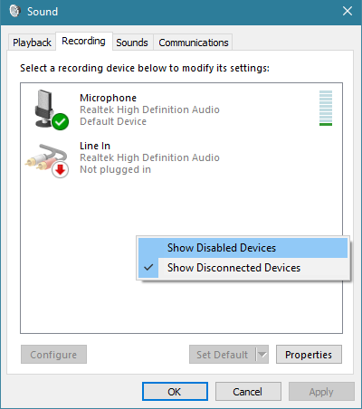
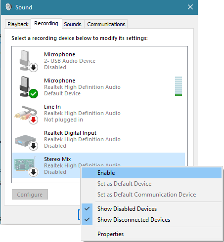
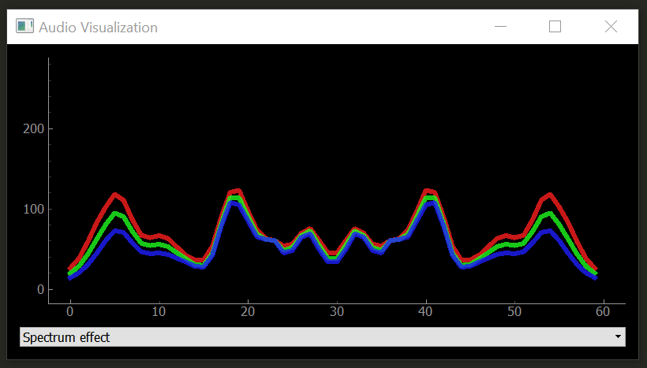

# Dancy Pi: Audio Reactive LEDs

This repo is my implementation of Scott Lawson's work. I did my best to simplify the installation process. The original Readme text can be found below my updated Readme. 

This repo is designed to work with Python 3+. Python 2 is no longer supported but it may still work without (m)any changes. I haven't done an integration with ESP8266 yet but 
still plan to in the future. 

The steps in this repo can be applied globally on your Pi or inside virtual environments like `venv` or `conda`. My tutorial does everything globally! 

# Demo

See the new demo at: https://www.youtube.com/watch?v=7YLF-N0596I

Join the Conversation on EasyProgramming at: https://www.easyprogramming.net/raspberrypi/audio_reactive_led.php

You can also watch the old demo at the following URL. You can see just how much time the new implementation saves: 
[https://www.youtube.com/watch?v=vY4P0MU62X8](https://www.youtube.com/watch?v=vY4P0MU62X8)

# Tutorial

A full video tutorial can be found on YouTube at https://www.youtube.com/watch?v=7YLF-N0596I
<a href="https://www.youtube.com/watch?v=7YLF-N0596I" target="_blank"></a>

More information on the tutorial can be found at https://www.easyprogramming.net/raspberrypi/audio_reactive_led.php

See the old tutorial on Branch [v1.0.0](../../tree/v1.0.0).

# Nazberry Pi Modifications

The following assumes that you have Raspberry Pi OS installed and your Pi is up to date with `sudo apt upgrade && sudo apt upgrade`.

### Install Git & Clone repo

I normally start the lite version of Raspberry Pi OS without desktop and recommended software so it usually doesn't come with Git installed. So let's install it:

```shell
sudo apt install git -y
```

After we install git, clone this repo:

```shell
git clone https://github.com/naztronaut/dancyPi-audio-reactive-led.git
```

Then let's head into our install directory and continue to the next step:

```shell
cd dancyPi-audio-reactive-led/python/install
```

### Install dependencies with `install.py`

In the previous version, there were MANY steps before the lights would work. I tried my best to simply this into one simple command which modifies the audio config files as needed
and installs all dependencies globally. Once you are in the install directory, run this command:

```shell
sudo python3 install.py
```

The installation should take a few minutes (depends on your internet speed and how many of the packages need a full install). The script is very simple. It runs a bunch of `sudo apt install`
and `pip3 install` commands followed by placing the `asound.conf` file in its proper location and modifying the `alsa.conf` as necessary by commenting out hardware that is not needed/used
and making sure the correct audio device is used. 

The script also installs the `rpi_ws281x` library which is used to actually turn the lights on and off. In the previous version, this install required about 8 steps on its own. Now it's done
through the install script. Since it's done this way, there's no more "demo" script that you can run. I will maybe work on one later (may or may not be in another repo). 

You'll still need to make some edits to fit your needs. 

### `config.py` has been edited as follows:

```python
DEVICE = 'pi'
USE_GUI = False
DISPLAY_FPS = False
N_PIXELS = 144
MIC_RATE = 48000
FPS = 50
```

I'm using the standalone Raspberry Pi with a 144 LED strip. The USB Microphone that I'm using has a rate of 48000 hz. And I turned the FPS down to 50 but I was easily getting 
90 FPS without issues. 

I'm also using this headless so the GUI and FPS have been turned off for better performance. 

### `visualization.py` has been edited as follows:

Added the following after line 9 to allow reading command line arguments:

```python
import sys

visualization_type = sys.argv[1]
``` 

Also added if/elif statements starting on line 256 to assign the above `visualization_type` variable to `visualization_effect` variable on line 265. This now accepts an extra 
command line argument which tells the script which visualization to run. The options are `spectrum`, `energy`, or `scroll`. To run this, simply run:

```shell
sudo python3 visualization.py scroll
``` 

You can substitute `scroll` for either `energy` or `spectrum`for the other two effects. 

### `off.py` was added to the package

Contains python code to turn off all the LEDs after the off command was sent. Change the `LED_COUNT` if your LED count is different from 144. 


### Troubleshooting

#### Audio Device not recognized

Turn off your pi, plug your USB Mic in, then turn your Pi back on.  I've noticed that sometimes, the Pi won't easily recognize a new usb device. 

#### [#2](/../../issues/2) PHP URL commands not activating visualizations
Most users should not have to do this but if you are experiencing the following error when trying to run the script via a browser:

```
sudo: no tty present and no askpass program specified
```
Add the following to your `/etc/sudoers` file:

```
www-data ALL = NOPASSWD: /usr/bin/python
```

## Authors
* **Nazmus Nasir** - [Nazm.us](https://nazm.us) - Owner of EasyProgramming.net

## License

This project is licensed under the MIT License - see the [LICENSE.txt](LICENSE.txt) file for details

# Questions ?
Have questions? You can reach me through several different channels. You can ask a question in the  [issues forum](/../../issues), 
on [EasyProgramming.net](https://www.easyprogramming.net), or on the video comments on YouTube. 


# Contribute 
I will accept Pull requests fixing bugs or adding new features after I've vetted them. Feel free to create pull requests! 

------------------------------------------------------------------------------------
------------------------------------------------------------------------------------

# The items below were untouched from the original project by Scott Lawson

------------------------------------------------------------------------------------
------------------------------------------------------------------------------------

# Audio Reactive LED Strip
Real-time LED strip music visualization using Python and the ESP8266 or Raspberry Pi.


# Demo (click gif for video)

[](https://www.youtube.com/watch?v=HNtM7jH5GXgD)

# Overview
The repository includes everything needed to build an LED strip music visualizer (excluding hardware):

- Python visualization code, which includes code for:
  - Recording audio with a microphone ([microphone.py](python/microphone.py))
  - Digital signal processing ([dsp.py](python/dsp.py))
  - Constructing 1D visualizations ([visualization.py](python/visualization.py))
  - Sending pixel information to the ESP8266 over WiFi ([led.py](python/led.py))
  - Configuration and settings ([config.py](python/config.py))
- Arduino firmware for the ESP8266 ([ws2812_controller_esp8266.ino](arduino/ws2812_controller_esp8266/ws2812_controller_esp8266.ino))

# What do I need to make one?
## Computer + ESP8266
To build a visualizer using a computer and ESP8266, you will need:
- Computer with Python 2.7 or 3.5 ([Anaconda](https://www.anaconda.com/distribution/) is recommended on Windows)
- ESP8266 module with RX1 pin exposed. These modules can be purchased for as little as $5 USD. These modules are known to be compatible, but many others will work too:
  - NodeMCU v3
  - Adafruit HUZZAH
  - Adafruit Feather HUZZAH
- WS2812B LED strip (such as Adafruit Neopixels). These can be purchased for as little as $5-15 USD per meter.
- 5V power supply
- 3.3V-5V level shifter (optional, must be non-inverting)

Limitations when using a computer + ESP8266:
- The communication protocol between the computer and ESP8266 currently supports a maximum of 256 LEDs.

## Standalone Raspberry Pi
You can also build a standalone visualizer using a Raspberry Pi. For this you will need: 
- Raspberry Pi (1, 2, or 3)
- USB audio input device. This could be a USB microphone or a sound card. You just need to find some way of giving the Raspberry Pi audio input.
- WS2812B LED strip (such as Adafruit Neopixels)
- 5V power supply
- 3.3V-5V level shifter (optional)

Limitations when using the Raspberry Pi:
- Raspberry Pi is just fast enough the run the visualization, but it is too slow to run the GUI window as well. It is recommended that you disable the GUI when running the code on the Raspberry Pi.
- The ESP8266 uses a technique called temporal dithering to improve the color depth of the LED strip. Unfortunately the Raspberry Pi lacks this capability.

# Installation for Computer + ESP8266
## Python Dependencies
Visualization code is compatible with Python 2.7 or 3.5. A few Python dependencies must also be installed:
- Numpy
- Scipy (for digital signal processing)
- PyQtGraph (for GUI visualization)
- PyAudio (for recording audio with microphone)

On Windows machines, the use of [Anaconda](https://www.anaconda.com/distribution/) is **highly recommended**. Anaconda simplifies the installation of Python dependencies, which is sometimes difficult on Windows.

### Installing dependencies with Anaconda
Create a [conda virtual environment](http://conda.pydata.org/docs/using/envs.html) (this step is optional but recommended)
```
conda create --name visualization-env python=3.5
activate visualization-env
```
Install dependencies using pip and the conda package manager
```
conda install numpy scipy pyqtgraph
pip install pyaudio
```

### Installing dependencies without Anaconda
The pip package manager can also be used to install the python dependencies.
```
pip install numpy
pip install scipy
pip install pyqtgraph
pip install pyaudio
```
If `pip` is not found try using `python -m pip install` instead.

## Arduino dependencies
ESP8266 firmare is uploaded using the Arduino IDE. See [this tutorial](https://learn.sparkfun.com/tutorials/esp8266-thing-hookup-guide/installing-the-esp8266-arduino-addon) to setup the Arduino IDE for ESP8266.

### Install NeoPixelBus library
[Download Here](https://github.com/Makuna/NeoPixelBus) or using library manager, search for "NeoPixelBus".

## Hardware Connections
### ESP8266
The ESP8266 has hardware support for [I²S](https://en.wikipedia.org/wiki/I%C2%B2S) and this peripheral is used <!-- by the [ws2812b i2s library](https://github.com/JoDaNl/esp8266_ws2812_i2s)  -->to control the ws2812b LED strip. This signficantly improves performance compared to bit-banging the IO pin. Unfortunately, this means that the LED strip **must** be connected to the RX1 pin, which is not accessible in some ESP8266 modules (such as the ESP-01).

The RX1 pin on the ESP8266 module should be connected to the data input pin of the ws2812b LED strip (often labelled DIN or D0).

For the NodeMCU v3 and Adafruit Feather HUZZAH, the location of the RX1 pin is shown in the images below. Many other modules also expose the RX1 pin.


### Raspberry Pi
Since the Raspberry Pi is a 3.3V device, the best practice is to use a logic level converter to shift the 3.3V logic to 5V logic (WS2812 LEDs use 5V logic). There is a good overview on the [best practices here](https://learn.adafruit.com/adafruit-neopixel-uberguide/best-practices).

Although a logic level converter is the best practice, sometimes it will still work if you simply connect the LED strip directly to the Raspberry Pi.

You cannot power the LED strip using the Raspberry Pi GPIO pins, you need to have an external 5V power supply.

The connections are:

* Connect GND on the power supply to GND on the LED strip and GND on the Raspberry Pi (they MUST share a common GND connection)
* Connect +5V on the power supply to +5V on the LED strip
* Connect a PWM GPIO pin on the Raspberry Pi to the data pin on the LED strip. If using the Raspberry Pi 2 or 3, then try Pin 18(GPIO5).

# Setup and Configuration
1. Install Python and Python dependencies
2. [Install Arduino IDE and ESP8266 addon](https://learn.sparkfun.com/tutorials/esp8266-thing-hookup-guide/installing-the-esp8266-arduino-addon)
3. Download and extract all of the files in this repository onto your computer
4. Connect the RX1 pin of your ESP8266 module to the data input pin of the ws2812b LED strip. Ensure that your LED strip is properly connected to a 5V power supply and that the ESP8266 and LED strip share a common electrical ground connection.
5. In [ws2812_controller.ino](arduino/ws2812_controller/ws2812_controller.ino):
  - Set `const char* ssid` to your router's SSID
  - Set `const char* password` to your router's password
  - Set `IPAddress gateway` to match your router's gateway
  - Set `IPAddress ip` to the IP address that you would like your ESP8266 to use (your choice)
  - Set `#define NUM_LEDS` to the number of LEDs in your LED strip
6. Upload the [ws2812_controller.ino](arduino/ws2812_controller/ws2812_controller.ino) firmware to the ESP8266. Ensure that you have selected the correct ESP8266 board from the boards menu. In the dropdown menu, set `CPU Frequency` to 160 MHz for optimal performance.
7. In [config.py](python/config.py):
  - Set `N_PIXELS` to the number of LEDs in your LED strip (must match `NUM_LEDS` in [ws2812_controller.ino](arduino/ws2812_controller/ws2812_controller.ino))
  - Set `UDP_IP` to the IP address of your ESP8266 (must match `ip` in [ws2812_controller.ino](arduino/ws2812_controller/ws2812_controller.ino))
  - If needed, set `MIC_RATE` to your microphone sampling rate in Hz. Most of the time you will not need to change this.

# Installation for Raspberry Pi
If you encounter any problems running the visualization on a Raspberry Pi, please [open a new issue](https://github.com/scottlawsonbc/audio-reactive-led-strip/issues). Also, please consider opening an issue if you have any questions or suggestions for improving the installation process.

Download and extract all of the files in this repository onto your pi to begin.

## Installing the Python dependencies
Install python dependencies using apt-get
```
sudo apt-get update
sudo apt-get install python-numpy python-scipy python-pyaudio
```

## Audio device configuration
For the Raspberry Pi, a USB audio device needs to be configured as the default audio device.

Create/edit `/etc/asound.conf`
```
sudo nano /etc/asound.conf
```
Set the file to the following text
```
pcm.!default {
    type hw
    card 1
}
ctl.!default {
    type hw
    card 1
}
```

Next, set the USB device to as the default device by editing `/usr/share/alsa/alsa.conf`
```
sudo nano /usr/share/alsa/alsa.conf
```
Change
```
defaults.ctl.card 0
defaults.pcm.card 0
```
To
```
defaults.ctl.card 1
defaults.pcm.card 1
```

## Test the LED strip
1. cd rpi_ws281x/python/examples
2. sudo nano strandtest.py
3. Configure the options at the top of the file. Enable logic inverting if you are using an inverting logic-level converter. Set the correct GPIO pin and number of pixels for the LED strip. You will likely need a logic-level converter to convert the Raspberry Pi's 3.3V logic to the 5V logic used by the ws2812b LED strip.
4. Run example with 'sudo python strandtest.py'

## Configure the visualization code
In `config.py`, set the device to `'pi'` and configure the GPIO, LED and other hardware settings.
If you are using an inverting logic level converter, set `LED_INVERT = True` in `config.py`. Set `LED_INVERT = False` if you are not using an inverting logic level converter (i.e. connecting LED strip directly to GPIO pin).

# Audio Input
The visualization program streams audio from the default audio input device (set by the operating system). Windows users can change the audio input device by [following these instructions](http://blogs.creighton.edu/bluecast/tips-and-tricks/set-the-default-microphone-and-adjust-the-input-volume-in-windows-7/).

Examples of typical audio sources:
* Audio cable connected to the audio input jack (requires USB sound card on Raspberry Pi)
* Webcam microphone, headset, studio recording microphone, etc

## Virtual Audio Source
You can use a "virtual audio device" to transfer audio playback from one application to another. This means that you can play music on your computer and connect the playback directly into the visualization program.


### Windows
On Windows, you can use "Stereo Mix" to copy the audio output stream into the audio input. Stereo Mix is only support on certain audio chipsets. If your chipset does not support Stereo Mix, you can use a third-party application such as [Voicemeeter](http://vb-audio.pagesperso-orange.fr/Voicemeeter/).



Go to recording devices under Windows Sound settings (Control Panel -> Sound). In the right-click menu, select "Show Disabled Devices".



Enable Stereo Mix and set it as the default device. Your audio playback should now be used as the audio input source for the visualization program. If your audio chipset does not support Stereo Mix then it will not appear in the list.

### Linux
Linux users can use [Jack Audio](http://jackaudio.org/) to create a virtual audio device.

### OSX
On OSX, [Loopback](https://www.rogueamoeba.com/loopback/) can be use to create a virtual audio device.

# Running the Visualization
Once everything has been configured, run [visualization.py](python/visualization.py) to start the visualization. The visualization will automatically use your default recording device (microphone) as the audio input.

A PyQtGraph GUI will open to display the output of the visualization on the computer. There is a setting to enable/disable the GUI display in [config.py](python/config.py)



If you encounter any issues or have questions about this project, feel free to [open a new issue](https://github.com/scottlawsonbc/audio-reactive-led-strip/issues).

# Limitations
* ESP8266 supports a maximum of 256 LEDs. This limitation will be removed in a future update. The Raspberry Pi can use more than 256 LEDs.
* Even numbers of pixels must be used. For example, if you have 71 pixels then use the next lowest even number, 70. Odd pixel quantities will be supported in a future update.

# License
This project was developed by Scott Lawson and is released under the MIT License.
